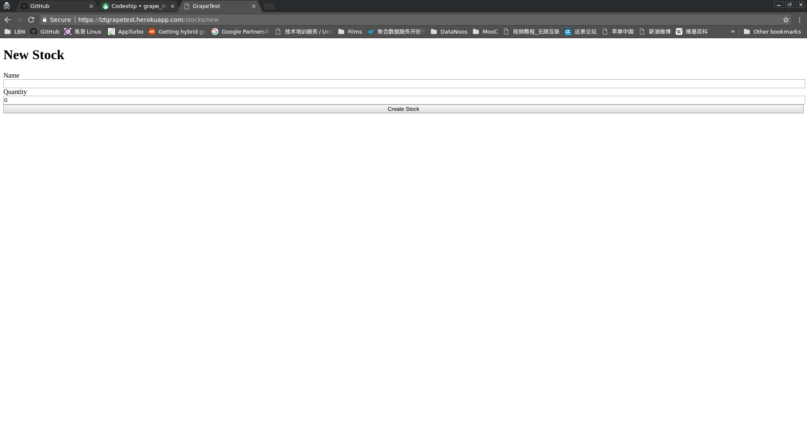
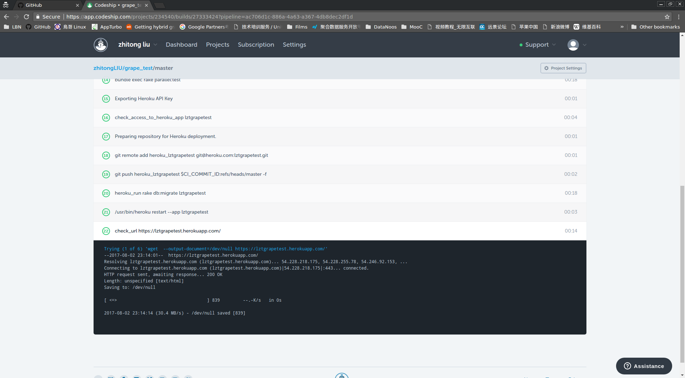

# Grape test

This application is for testing propose
It use Grape for creating a simple API for stock getion

## Stacks

Grape-api Grape-entity for api construction

Trailblazer-rails(v1) for doing operations

Audits for recording model's changes

Swagger for Api's documentations

## Ruby version

tested for 2.2.3

## Configuration

bundle install

## Database creation

bundle exec rails db:create

## Database initialization

bundle exec rails db:migrate

## How to run the test suite

bundle exec rake

## Deployment instructions

it use codeship for CI & CD

Please visit

https://lztgrapetest.herokuapp.com/

https://lztgrapetest.herokuapp.com/api/swagger

## Screenshots

